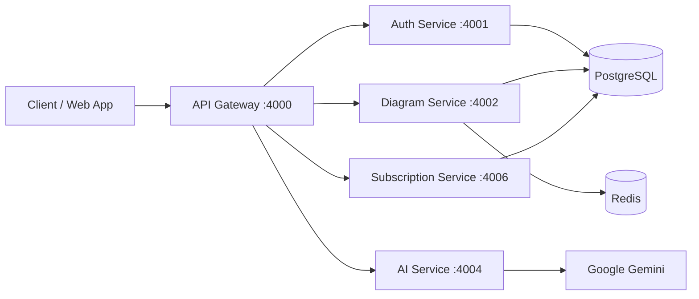

# Fluxo.io

Fluxo.io is a microservice-based diagram and collaboration platform built in a Turborepo monorepo.

## Overview

- Frontend app: Next.js (`apps/web`)
- API entrypoint: Express API Gateway (`apps/api-gateway`)
- Backend services:
  - Auth Service (`apps/services/auth-service`)
  - Diagram Service (`apps/services/diagram-service`)
  - AI Service (`apps/services/ai-service`)
  - Subscription Service (`apps/services/subscription-service`)
- Shared packages: Zod schemas, ESLint config, TypeScript config

## Tech Stack (Image Section)


## Architecture



For detailed architecture, see [ARCHITECTURE.md](./ARCHITECTURE.md).

## Service Ports

| Component            | Default Port |
| -------------------- | ------------ |
| Web App              | `3000`       |
| API Gateway          | `4000`       |
| Auth Service         | `4001`       |
| Diagram Service      | `4002`       |
| AI Service           | `4004`       |
| Subscription Service | `4006`       |

## API Surface (Gateway)

- Auth: `/api/v1/auth/*`
- Diagram: `/api/v1/diagram/*`
- Diagram aliases (backward compatible): `/api/v1/projects/*`, `/api/v1/diagrams/*`, `/api/v1/invitations/*`
- AI: `/api/v1/ai/*`
- Subscription: `/api/v1/subscription/*`

## Monorepo Structure

```text
apps/
  api-gateway/
  web/
  landing/
  services/
    auth-service/
    diagram-service/
    ai-service/
    subscription-service/
packages/
  zod-schemas/
  eslint-config/
  typescript-config/
```

## Quick Start

### 1. Install dependencies

```bash
pnpm install
```

### 2. Configure environment variables

Create `.env` from each app's `.env.example`:

- `apps/api-gateway/.env`
- `apps/services/auth-service/.env`
- `apps/services/diagram-service/.env`
- `apps/services/ai-service/.env`
- `apps/services/subscription-service/.env`
- `apps/web/.env`

### 3. Start all apps in development

```bash
pnpm dev
```

### 4. Build all workspaces

```bash
pnpm build
```

## Useful Commands

- `pnpm dev` - run all workspace dev servers
- `pnpm build` - build all workspaces
- `pnpm lint` - run lint tasks
- `pnpm type-check` - run type-check tasks
- `pnpm format` - format `ts/tsx/md`

## Service Docs

- [API Gateway](./apps/api-gateway/README.md)
- [Services Index](./apps/services/README.md)
- [Auth Service](./apps/services/auth-service/README.md)
- [Auth API Reference](./apps/services/auth-service/API_REFERENCE.md)
- [Diagram Service](./apps/services/diagram-service/README.md)
- [AI Service](./apps/services/ai-service/README.md)
- [Subscription Service](./apps/services/subscription-service/README.md)
- [Web App](./apps/web/README.md)

## Notes

- The gateway validates JWT and forwards identity headers (`x-user-id`, `x-user-email`) to downstream services.
- Some diagram routes are intentionally kept as aliases for backward compatibility.
- Cookie names used by auth flow: `access_token`, `refresh_token`.
