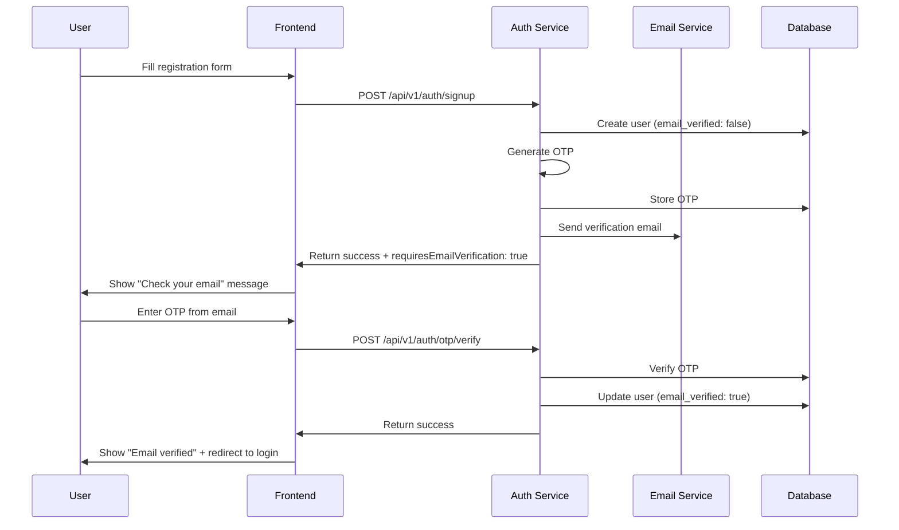

# 📧 Email Verification Flow

This document describes the complete email verification flow implemented in the auth service, including user registration, OTP generation, verification, and error handling.

## 🔄 Complete Flow Overview



## 📋 Step-by-Step Implementation

### 1. User Registration

When a user registers, the system:

1. **Validates input** using Zod schemas
2. **Checks for existing user** to prevent duplicates
3. **Creates user account** with `email_verified: false`
4. **Generates OTP** for email verification
5. **Sends verification email** via Nodemailer
6. **Returns success response** with verification requirement

```javascript
// Registration endpoint
POST /api/v1/auth/signup
{
  "name": "John Doe",
  "email": "john@example.com",
  "password": "securePassword123"
}

// Response
{
  "message": "User registered successfully. A verification OTP has been sent to your email.",
  "user": {
    "id": "uuid",
    "name": "John Doe",
    "email": "john@example.com",
    "email_verified": false
  },
  "requiresEmailVerification": true
}
```

### 2. OTP Generation

The system generates a secure 6-digit OTP:

```javascript
// OTP Properties
{
  length: 6,
  type: "numeric",
  expiration: "10 minutes",
  maxAttempts: 3,
  purpose: "email_verification"
}
```

**Security Features:**

- ✅ Cryptographically secure random generation
- ✅ Time-limited expiration (10 minutes)
- ✅ Attempt limiting (3 tries max)
- ✅ One-time use only
- ✅ Purpose-specific (email_verification)

### 3. Email Delivery

The verification email is sent using Nodemailer:

```javascript
// Email Template
Subject: "Verify Your Email - Fluxo.io"
From: "no-reply@fluxo.io"

Body:
"Hello John Doe,

Your verification code is: 123456

This code will expire in 10 minutes.

If you didn't request this verification, please ignore this email.

Best regards,
The Fluxo Team"
```

### 4. OTP Verification

Users enter the OTP to verify their email:

```javascript
// Verification endpoint
POST /api/v1/auth/otp/verify
{
  "email": "john@example.com",
  "otpCode": "123456",
  "purpose": "email_verification"
}

// Success Response
{
  "message": "OTP verified successfully",
  "emailVerified": true
}
```

**Verification Process:**

1. **Validate input** (email, OTP format, purpose)
2. **Check user exists** in database
3. **Find active OTP** for user and purpose
4. **Verify OTP code** matches stored value
5. **Check expiration** (not expired)
6. **Check attempts** (not exceeded)
7. **Mark OTP as used** and update user
8. **Set email_verified = true**

### 5. Login After Verification

Once email is verified, users can sign in:

```javascript
// Login endpoint
POST /api/v1/auth/signin
{
  "email": "john@example.com",
  "password": "securePassword123"
}

// Success Response
{
  "message": "Sign in success",
  "user": {
    "id": "uuid",
    "name": "John Doe",
    "email": "john@example.com",
    "email_verified": true
  }
}
```

**Login Validation:**

- ✅ User exists
- ✅ Password is correct
- ✅ Email is verified (`email_verified: true`)
- ✅ Account is not locked

## 🔄 Alternative Flows

### Resend OTP

If users don't receive the email or OTP expires:

```javascript
// Resend OTP endpoint
POST /api/v1/auth/otp/resend
{
  "email": "john@example.com",
  "purpose": "email_verification"
}

// Response
{
  "message": "OTP resent successfully",
  "expiresIn": 600
}
```

**Resend Logic:**

1. **Check for existing OTP** (active or expired)
2. **Invalidate old OTP** if exists
3. **Generate new OTP** with fresh expiration
4. **Send new email** with updated code
5. **Reset attempt counter** to 0

### OTP Status Check

Check if user has an active OTP:

```javascript
// OTP Status endpoint
GET /api/v1/auth/otp/status?purpose=email_verification
Authorization: Bearer <jwt_token>

// Response
{
  "status": {
    "hasActiveOTP": true,
    "isExpired": false,
    "attemptsRemaining": 2,
    "expiresAt": "2024-01-15T10:30:00Z"
  }
}
```

## ⚠️ Error Handling

### Common Error Scenarios

#### 1. Invalid OTP

```json
{
  "error": "Invalid OTP",
  "message": "The OTP code you entered is incorrect. Please check and try again."
}
```

#### 2. Expired OTP

```json
{
  "error": "OTP expired",
  "message": "The OTP has expired. Please request a new one."
}
```

#### 3. Too Many Attempts

```json
{
  "error": "Too many attempts",
  "message": "You've exceeded the maximum number of attempts. Please request a new OTP."
}
```

#### 4. User Not Found

```json
{
  "error": "User not found",
  "message": "No account found with this email. Please check your email or sign up."
}
```

#### 5. Email Already Verified

```json
{
  "error": "Email already verified",
  "message": "This email has already been verified."
}
```

### Error Recovery

**For Invalid/Expired OTP:**

1. Show clear error message
2. Allow user to request new OTP
3. Provide resend button

**For Too Many Attempts:**

1. Lock OTP for security
2. Require new OTP generation
3. Show cooldown period

**For User Not Found:**

1. Suggest registration
2. Check email spelling
3. Provide signup link

## 🔒 Security Considerations

### OTP Security

1. **Rate Limiting**: Max 3 attempts per OTP
2. **Time Expiration**: 10-minute window
3. **One-time Use**: OTP invalidated after successful use
4. **Secure Generation**: Cryptographically secure random
5. **Purpose Binding**: OTP tied to specific purpose

### Email Security

1. **Email Validation**: Proper email format required
2. **Domain Validation**: Check for valid email domains
3. **Spam Prevention**: Rate limit email sending
4. **Template Security**: No XSS in email templates

### Database Security

1. **OTP Storage**: Secure storage with expiration
2. **User Data**: Encrypted sensitive information
3. **Audit Trail**: Log all verification attempts
4. **Cleanup**: Automatic expired OTP removal

## 📊 Monitoring & Analytics

### Key Metrics to Track

1. **Registration Success Rate**: % of successful registrations
2. **Email Delivery Rate**: % of emails successfully sent
3. **OTP Verification Rate**: % of OTPs successfully verified
4. **Time to Verification**: Average time from registration to verification
5. **Resend Rate**: % of users who need to resend OTP
6. **Error Rates**: Frequency of different error types

### Logging

```javascript
// Example log entries
logger.info("User registered successfully", { userId, email });
logger.info("OTP generated for email verification", { userId, email, purpose });
logger.info("Email sent successfully", { userId, email, purpose });
logger.info("OTP verified successfully", { userId, email, purpose });
logger.warn("OTP verification failed", { userId, email, reason });
logger.error("Email sending failed", { userId, email, error });
```

## 🧪 Testing

### Unit Tests

Test individual components:

- OTP generation
- Email sending
- Verification logic
- Error handling

### Integration Tests

Test complete flows:

- Registration → Email → Verification
- Resend OTP flow
- Error scenarios
- Edge cases

### End-to-End Tests

Test user experience:

- Complete registration flow
- Email delivery
- OTP verification
- Login after verification

## 🚀 Production Considerations

### Performance

1. **Database Indexing**: Index on email, user_id, purpose
2. **OTP Cleanup**: Regular cleanup of expired OTPs
3. **Email Queuing**: Queue emails for better performance
4. **Caching**: Cache user verification status

### Scalability

1. **Database Sharding**: Partition by user_id or email
2. **Email Service**: Use dedicated email service (SendGrid, etc.)
3. **Load Balancing**: Multiple auth service instances
4. **Monitoring**: Comprehensive monitoring and alerting

### Reliability

1. **Email Fallback**: Multiple email providers
2. **Database Backup**: Regular backups
3. **Error Recovery**: Graceful error handling
4. **Health Checks**: Service health monitoring

---

This email verification flow provides a secure, user-friendly experience while maintaining high security standards and reliability.
